# Gym app

Gym app for Tafe stage 2 assessment

- Backend MVC app
- Backend API (coming soon)
- Frontend React app (coming soon)

```mermaid
%% Generated by https://gitdiagram.com/petersem/gym
flowchart TD

subgraph group_web["Web application"]
  node_server["HTTP server<br/>[server.mjs]"]
  node_auth["Authentication"]
  node_validation["Form validation<br/>[formValidation.mjs]"]
  node_feedback["Form feedback<br/>[formFeedback.mjs]"]
  node_views["EJS pages"]
end

subgraph group_domain["Gym management"]
  node_activities["Activities"]
  node_locations["Locations"]
  node_sessions["Sessions"]
  node_bookings["Bookings"]
  node_users["User management"]
  node_blog["Blog management<br/>[BlogController.mjs]"]
end

subgraph group_persistence["Persistence"]
  node_activity_model["Activity records"]
  node_location_model["Location records<br/>[LocationModel.mjs]"]
  node_session_model["Session records<br/>[SessionsModel.mjs]"]
  node_booking_model["Booking records<br/>[BookingsModel.mjs]"]
  node_user_model["User records<br/>[UsersModel.mjs]"]
  node_blog_model["Blog records<br/>[BlogModel.mjs]"]
  node_db_model["Database access<br/>[DatabaseModel.mjs]"]
end

subgraph group_bootstrap["Database setup"]
  node_initializer["Schema initialization"]
  node_admin_seed["Admin account setup<br/>[ensureAdmin.mjs]"]
end

node_visitor(("Gym user"))
node_mysql[("MySQL database")]

node_visitor -->|"submits requests"| node_server
node_server -->|"routes to"| node_auth
node_server -->|"routes to"| node_activities
node_server -->|"routes to"| node_locations
node_server -->|"routes to"| node_sessions
node_server -->|"routes to"| node_bookings
node_server -->|"routes to"| node_users
node_server -->|"routes to"| node_blog
node_server -->|"installs middleware"| node_feedback
node_server -->|"renders dashboard"| node_views
node_auth -->|"loads and creates"| node_user_model
node_activities -->|"queries"| node_activity_model
node_locations -->|"queries"| node_location_model
node_sessions -->|"queries"| node_session_model
node_sessions -->|"loads activities"| node_activity_model
node_sessions -->|"loads locations"| node_location_model
node_sessions -->|"deletes session bookings"| node_booking_model
node_bookings -->|"queries and updates"| node_booking_model
node_bookings -->|"loads sessions"| node_session_model
node_bookings -->|"loads locations"| node_location_model
node_bookings -->|"loads activities"| node_activity_model
node_bookings -->|"loads users"| node_user_model
node_users -->|"queries"| node_user_model
node_blog -->|"queries"| node_blog_model
node_blog -->|"loads authors"| node_user_model
node_activities -->|"uses management rules"| node_validation
node_auth -->|"rejects invalid forms"| node_validation
node_blog -->|"uses management rules"| node_validation
node_sessions -->|"uses management rules"| node_validation
node_validation -->|"saves form errors"| node_feedback
node_activities -.->|"renders management"| node_views
node_locations -.->|"renders management"| node_views
node_sessions -.->|"renders management"| node_views
node_bookings -.->|"renders management"| node_views
node_users -.->|"renders management"| node_views
node_blog -->|"renders management"| node_views
node_activity_model -->|"inherits queries"| node_db_model
node_location_model -->|"inherits queries"| node_db_model
node_session_model -->|"inherits queries"| node_db_model
node_user_model -->|"inherits queries"| node_db_model
node_blog_model -->|"uses database access"| node_db_model
node_booking_model -.->|"uses database access"| node_db_model
node_db_model -->|"queries"| node_mysql
node_initializer -->|"ensures admin"| node_admin_seed
node_initializer -->|"initializes schema"| node_mysql

click node_server "https://github.com/petersem/gym/blob/main/backend/src/server.mjs"
click node_auth "https://github.com/petersem/gym/blob/main/backend/src/controllers/AuthenticationController.mjs"
click node_validation "https://github.com/petersem/gym/blob/main/backend/src/utilities/formValidation.mjs"
click node_feedback "https://github.com/petersem/gym/blob/main/backend/src/middleware/formFeedback.mjs"
click node_views "https://github.com/petersem/gym/tree/main/backend/src/views"
click node_activities "https://github.com/petersem/gym/blob/main/backend/src/controllers/ActivitiesController.mjs"
click node_locations "https://github.com/petersem/gym/blob/main/backend/src/controllers/LocationController.mjs"
click node_sessions "https://github.com/petersem/gym/blob/main/backend/src/controllers/SessionsController.mjs"
click node_bookings "https://github.com/petersem/gym/blob/main/backend/src/controllers/BookingsController.mjs"
click node_users "https://github.com/petersem/gym/blob/main/backend/src/controllers/UsersController.mjs"
click node_blog "https://github.com/petersem/gym/blob/main/backend/src/controllers/BlogController.mjs"
click node_activity_model "https://github.com/petersem/gym/blob/main/backend/src/models/ActivitiesModel.mjs"
click node_location_model "https://github.com/petersem/gym/blob/main/backend/src/models/LocationModel.mjs"
click node_session_model "https://github.com/petersem/gym/blob/main/backend/src/models/SessionsModel.mjs"
click node_booking_model "https://github.com/petersem/gym/blob/main/backend/src/models/BookingsModel.mjs"
click node_user_model "https://github.com/petersem/gym/blob/main/backend/src/models/UsersModel.mjs"
click node_blog_model "https://github.com/petersem/gym/blob/main/backend/src/models/BlogModel.mjs"
click node_db_model "https://github.com/petersem/gym/blob/main/backend/src/models/DatabaseModel.mjs"
click node_initializer "https://github.com/petersem/gym/blob/main/backend/src/database/initializeDatabase.mjs"
click node_admin_seed "https://github.com/petersem/gym/blob/main/backend/src/database/ensureAdmin.mjs"

classDef toneNeutral fill:#f8fafc,stroke:#334155,stroke-width:1.5px,color:#0f172a
classDef toneBlue fill:#dbeafe,stroke:#2563eb,stroke-width:1.5px,color:#172554
classDef toneAmber fill:#fef3c7,stroke:#d97706,stroke-width:1.5px,color:#78350f
classDef toneMint fill:#dcfce7,stroke:#16a34a,stroke-width:1.5px,color:#14532d
classDef toneRose fill:#ffe4e6,stroke:#e11d48,stroke-width:1.5px,color:#881337
classDef toneIndigo fill:#e0e7ff,stroke:#4f46e5,stroke-width:1.5px,color:#312e81
classDef toneTeal fill:#ccfbf1,stroke:#0f766e,stroke-width:1.5px,color:#134e4a
class node_server,node_auth,node_validation,node_feedback,node_views,node_visitor toneBlue
class node_activities,node_locations,node_sessions,node_bookings,node_users,node_blog,node_mysql toneAmber
class node_activity_model,node_location_model,node_session_model,node_booking_model,node_user_model,node_blog_model,node_db_model toneMint
class node_initializer,node_admin_seed toneRose
```




## Running the code

> There is NO NEED to run any speific database or schema creation SQL. The application takes care of this for you.

### Development

- You will need to have mySQL v8 or above installed and running
- Configure the .env file
  Example `backend/.env`:

```
# app settings
PORT=3000

# database connection settings
DB_HOST=127.0.0.1
DB_PORT=3307
DB_ROOT_PASSWORD=rootymctooty
DB_NAME=gym

# database app user credentials
DB_USER=gymuser
DB_PASSWORD=Testing123!

# app admin credentials
ADMIN_EMAIL=admin@gym.com
ADMIN_PASSWORD=testing123

# Seed sample data into database
DATA_SEED=true
```

- If you have just cloned this repo, run `npm i` and `npm i -w backend` to install prerequisit packages.
- From the top-level folder, run the following command `npm run devall -w backend`

> This is how you will start the app in development every time.

- A database initialisation script process is started. If this is a new installation the following will execute, otherwise these steps will skip:
  - Create the database
  - Create tables and foriegn keys
  - Create a database user account for the application
  - Set priviledges for database user account
  - Create an application admin user if there is no admin
  - Seed sample data if a new database and the seed option is true
- The application is then started and available locally on the specified port.

### Docker

- Docker is installed and configured
- On your docker host machine, create and populate `.env` and a `compose.yaml` files. Suggested options below:

Example `.env`:

```
# app settings
PORT=3000

# database connection settings
DB_HOST=127.0.0.1
# This is the port if you want to connect with mysql workbench. Change as needed
DB_PORT=3307
# Your mySQL root password
DB_ROOT_PASSWORD=rootymctooty
DB_NAME=gym

# database app user credentials
DB_USER=gymuser
DB_PASSWORD=Testing123!

# app admin credentials
ADMIN_EMAIL=admin@gym.com
ADMIN_PASSWORD=testing123
DATA_SEED=true

```

Example `compose.yaml` file

```
services:
  gymdb:
    image: mysql:8.0
    container_name: gymdb
    restart: unless-stopped
    environment:
      MYSQL_ROOT_PASSWORD: ${DB_ROOT_PASSWORD}
      MYSQL_ROOT_HOST: "%"
    ports:
      - ${DB_PORT}:3306
    volumes:
      - gymdb-data:/var/lib/mysql
    healthcheck:
      # $$ defers expansion to the container so the healthcheck uses its own root password.
      test:
        [
          "CMD-SHELL",
          'MYSQL_PWD="$$MYSQL_ROOT_PASSWORD" mysqladmin ping -h 127.0.0.1 -uroot',
        ]
      interval: 10s
      timeout: 5s
      retries: 10
      start_period: 180s

  gymapp:
    image: petersem/gym:latest
    container_name: gymapp
    restart: unless-stopped
    ports:
      - "3001:3000"
    environment:
      NODE_ENV: production
      PORT: 3000
      DB_HOST: gymdb
      DB_PORT: 3306
      DB_USER: ${DB_USER}
      DB_PASSWORD: ${DB_PASSWORD}
      DB_NAME: ${DB_NAME}
      DB_INIT_USER: root
      DB_INIT_PASSWORD: ${DB_ROOT_PASSWORD}
      DATA_SEED: ${DATA_SEED:-false}
      ADMIN_EMAIL: ${ADMIN_EMAIL}
      ADMIN_PASSWORD: ${ADMIN_PASSWORD}
    depends_on:
      gymdb:
        condition: service_healthy

volumes:
  gymdb-data:
```

Once you have configured these files, from the same directory, run `docker compose up -d gymapp` This will first create and install mySQL, and then it will create a container for the gym app.

> If this is the first time the database is being created, this process can take a couple of minutes before things are running. Be patient!

Once it says gymdb is `healthy` and gymapp says `running`, the app is ready to be opened in a browser on the docker host ip:[specified port]
